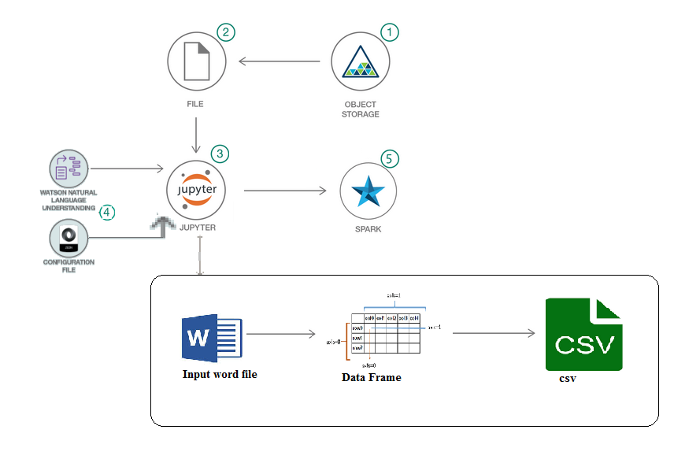

# Automating-the-process-of-extracting-features-for-ml-model-from-unstructured-data
`Disclaimer : The data(facts about Tuberculosis, Pulmonologist's Reports and Lab-reports of the patient) used in this Code Pattern is just a dummy data for showcasing the strategy and not to be put to actual use.`

A recommendation or decision in a business is based on information from multiple sources. The sources can contain data in structured and unstructured format. Whenever we need to analyse a recommendation or a decision, we need all the information that went into making the decision. This code pattern aims to build a recommendation table that can be used to analyse or audit a recommendation or decision.

Let us take the example of recommendations in the healthcare domain. A doctors recommendation to treat a patient can take into consideration the below information:
- age, weight, BP 
- symptoms
- any known illnesses
- family medical history
- current medication and more depending on the situation
- previous treatment history

A specialist deals with varied cases every single day. It is not feasible to remember the record of every patient and every case they come across on daily basis. This makes it difficult to audit a recommendation and give a personalised consultation as all the information is not available in one place. A recommendation table can assist in giving proper care to patient or to even get a second opinion as all information leading to the recommendation is available at one place.

In this Code Pattern, we have showcased the strategy on how a recommendation or a decision-support table can be formed by mining different types of documents like lab reports, doctors transcripts, etc. and curate it in one place which can aid the doctor in making more informed decisions about their patients.

For demonstration, we have taken tuberculosis diagnosis and built a recommendation table that can aid in giving personalised treatment to patients.

The below steps are followed in the code-pattern:
- The features and their values are extracted from a facts about Tuberculosis 
- Extract facts from Pulmonologist's Reports 
- Extract facts from Lab reports of the patient 
- Build a recommendation table

## Included components

* [IBM Watson Studio](https://console.bluemix.net/catalog/services/watson-studio): Analyze data using RStudio, Jupyter, and Python in a configured, collaborative environment that includes IBM value-adds, such as managed Spark.

* [IBM Cloud Object Storage](https://console.bluemix.net/catalog/infrastructure/cloud-object-storage): An IBM Cloud service that provides an unstructured cloud data store to build and deliver cost effective apps and services with high reliability and fast speed to market.

* [Watson Natural Language Understanding](https://console.bluemix.net/catalog/services/natural-language-understanding/?cm_sp=dw-bluemix-_-code-_-devcenter): A IBM Cloud service that can analyze text to extract meta-data from content such as concepts, entities, keywords, categories, sentiment, emotion, relations, semantic roles, using natural language understanding.

## Featured technologies

* [Jupyter Notebooks](http://jupyter.org/): An open-source web application that allows you to create and share documents that contain live code, equations, visualizations and explanatory text.
* [Natural Language Processing](https://machinelearningmastery.com/natural-language-processing/): the ability of a computer program to understand human language as it is spoken. NLP is a component of Artificial Intelligence
* [Python](https://www.python.org/): An interpreted high-level programming language for general-purpose programming

# Steps

Follow these steps to setup and run this code pattern. The steps are
described in detail below.

1. [Create IBM Cloud services](#1-create-ibm-cloud-services)
1. [Run using a Jupyter notebook in the IBM Watson Studio](#2-run-using-a-jupyter-notebook-in-the-ibm-watson-studio)
1. [Analyze the results](#3-analyze-the-results)

## 1. Create IBM Cloud services

Create the following IBM Cloud service:

  * [**Watson Natural Language Understanding**](https://console.bluemix.net/catalog/services/natural-language-understanding)

  

## 2. Run using a Jupyter notebook in the IBM Watson Studio

1. [Create a new Watson Studio project](#21-create-a-new-watson-studio-project)
2. [Create the notebook](#22-create-the-notebook)
3. [Upload data](#23-upload-data)
4. [Update notebook with service credentials](##24-update-notebook-with-service-credentials)
5. [Run the notebook](#25-run-the-notebook)
6. [Save and Share](#26-save-and-share)

### 2.1 Create a new Watson Studio project

* Log in or sign up for IBM's [Watson Studio](https://dataplatform.ibm.com).

* Select the `New Project` option from the Watson Studio landing page and choose the `Jupyter Notebooks` option.

* To create a project in Watson Studio, give the project a name and either create a new `Cloud Object Storage` service or select an existing one from your IBM Cloud account.

* Upon a successful project creation, you are taken to a dashboard view of your project. Take note of the `Assets` and `Settings` tabs, we'll be using them to associate our project with any external assets (datasets and notebooks) and any IBM cloud services.

### 2.2 Create the notebook

* From the project dashboard view, click the `Assets` tab, click the `+ New notebook` button.

* Give your notebook a name and select your desired runtime, in this case we'll be using the associated Spark runtime.

* Now select the `From URL` tab to specify the URL to the notebook in this repository.

* Click the `Create` button.

### 2.3 Upload data

#### Upload the data and configuration to the notebook

* From the `My Projects > Default` page, Use `Find and Add Data` (look for the `10/01` icon)
and its `Files` tab.
* Click `browse` and navigate to [data_doctor.zip]()
* Click `browse` and navigate to [config.txt]()

### 2.4 Update notebook with service credentials

#### 2.4.1 Add Watson NLU credentials to notebook

Get Watson NLU service credentials:

* On your IBM Cloud Dashboard, click on Watson NLU service instance. On the left hand navigation bar click Service Credentials
* If you see View Credentials under Service Credentials then click on the down arrow mark beside View Credentials. Make of note of the credentials.
* If you do not see View Credentials, then click New Credential to create new credentials and make a note of new credentials.

Select the cell below `2.1 Add your service credentials from IBM Cloud` for the Watson services section in the notebook to update username and password for Watson NLU.

#### 2.4.2 Add the Object Storage credentials to the notebook

Select the cell below `2.2 Add your service credentials for Object Storage` section in the notebook to update the credentials for Object Store.

* Delete the contents of the cell
* Use Find and Add Data (look for the 10/01 icon) and its Files tab. You should see the file names uploaded earlier. Make sure your active cell is the empty one below 2.2 Add...
* Under Files, click the dropdown for Insert to code for `data_doctor.zip`
* Click Insert StreamingBody object.
* Make sure the credentials are saved as streaming_body_1. If not edit and replace the numbers to 1. There should be four such occurrences in the cell.

* In the next cell, Delete the contents of the cell
* Use Find and Add Data (look for the 10/01 icon) and its Files tab. You should see the file names uploaded earlier. Make sure your active cell is the empty one below 2.2 Add...
* Under Files, click the dropdown for Insert to code for `config.txt`
* Click Insert Service Credentials.
* Make sure the credentials are saved as credentials_1. If not edit and replace the numbers to 1. There should be four such occurrences in the cell.

### 2.5 Run the notebook

When a notebook is executed, what is actually happening is that each code cell in
the notebook is executed, in order, from top to bottom.

Each code cell is selectable and is preceded by a tag in the left margin. The tag
format is `In [x]:`. Depending on the state of the notebook, the `x` can be:

* A blank, this indicates that the cell has never been executed.
* A number, this number represents the relative order this code step was executed.
* A `*`, this indicates that the cell is currently executing.

There are several ways to execute the code cells in your notebook:

* One cell at a time.
  * Select the cell, and then press the `Play` button in the toolbar.
* Batch mode, in sequential order.
  * From the `Cell` menu bar, there are several options available. For example, you
    can `Run All` cells in your notebook, or you can `Run All Below`, that will
    start executing from the first cell under the currently selected cell, and then
    continue executing all cells that follow.
* At a scheduled time.
  * Press the `Schedule` button located in the top right section of your notebook
    panel. Here you can schedule your notebook to be executed once at some future
    time, or repeatedly at your specified interval.

### 2.6 Save and Share

#### How to save your work:

Under the `File` menu, there are several ways to save your notebook:

* `Save` will simply save the current state of your notebook, without any version
  information.
* `Save Version` will save your current state of your notebook with a version tag
  that contains a date and time stamp. Up to 10 versions of your notebook can be
  saved, each one retrievable by selecting the `Revert To Version` menu item.

#### How to share your work:

You can share your notebook by selecting the “Share” button located in the top
right section of your notebook panel. The end result of this action will be a URL
link that will display a “read-only” version of your notebook. You have several
options to specify exactly what you want shared from your notebook:

* `Only text and output`: will remove all code cells from the notebook view.
* `All content excluding sensitive code cells`:  will remove any code cells
  that contain a *sensitive* tag. For example, `# @hidden_cell` is used to protect
  your dashDB credentials from being shared.
* `All content, including code`: displays the notebook as is.
* A variety of `download as` options are also available in the menu.

## 3. Analyze the Results

There are 3 main modules in the notebook:
Module 1----Factfile: Extract all possible symptoms from the Factfile, which in turn will the used as features(column name).

Module 2----Doctor Transcript: Extract the following features-
1.	Symptoms
2.	Lab test- yes or no (indicates if the doctor has given any lab tests) 
3.	Lab test names (only if lab test feature is yes)
4.	Recommendation

Module 3----Lab Report: This module is called only if the doctor mentions lab tests (i.e., if Lab Test from doctor transcript is yes).
In this module, we extract required test names and its corresponding result. 
Data Frame: We initially represent all the features and its values as ordered dictionary and then feed it to the dataframe. 

-	Take features(symptoms) as key from FactFile module and compare them with the symptoms in Doctor Transcript module. If we find the symptom in the Doctor Transcript module then the corresponding value of the feature would be YES else it would be NO.

-	Check if the Lab Test is YES or NO from the Doctor Transcript module. 
If YES then we extract the test names and final recommendation,
If NO then we extract only the recommendation.

-	Check if the Lab Test is YES or NO from the Doctor Transcript module. 
If YES then we extract the test names and corresponding result. Now all these key value pairs will fed to the pandas dataframe function. Finally a dataframe is formed where each row is one patient’s case. The formed dataframe is then converted to a csv file, to feed into the ML model.

